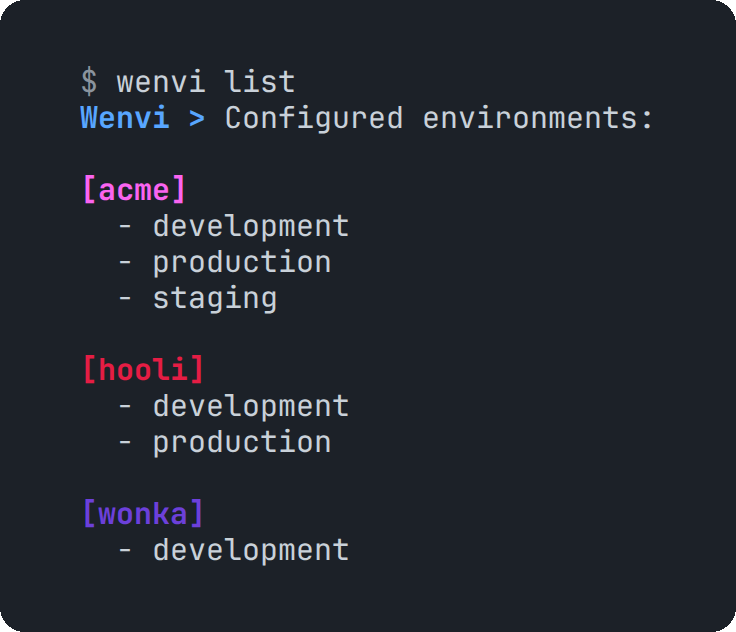
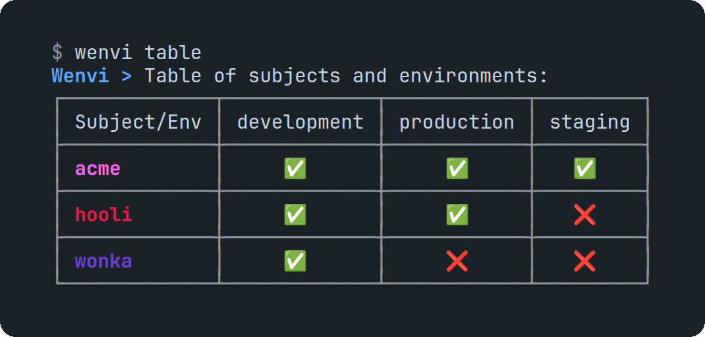
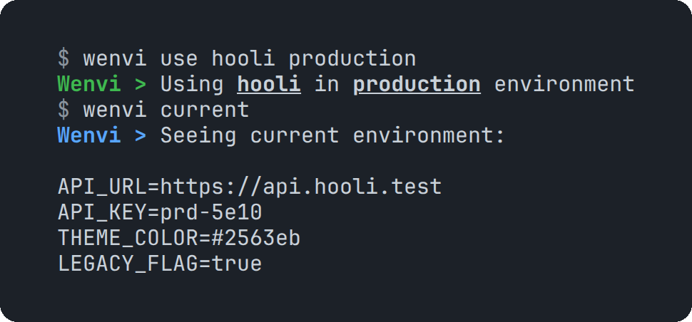
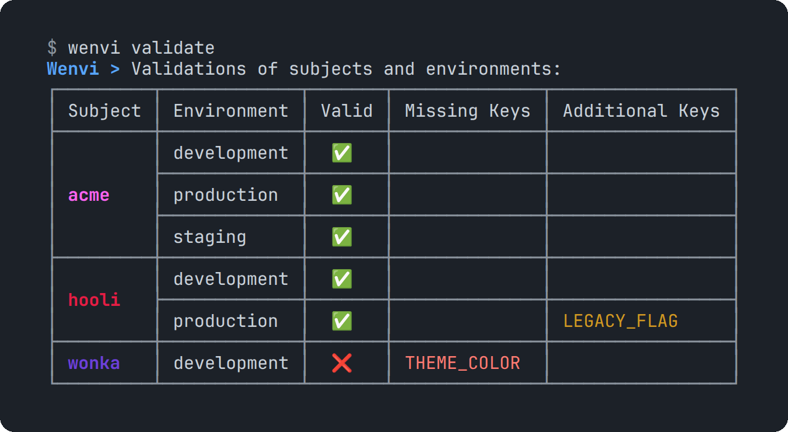

<h1 align="center">🌄 wenvi</h1>

<br>

<h3 align="center">A CLI to organize and quickly switch .env files.<br>Built for whitelabel apps, where every client has its own environments</h3>

<p align="center">
  <a href="https://www.npmjs.com/package/wenvi"></a>  <a href="https://github.com/Petri-Hub/wenvi/commits/production"></a>
</p>

<br>

## About

> **TL;DR:** in a whitelabel app the same code ships for several clients, and each one needs its own `.env` for development, production and whatever else. Wenvi keeps them in an `environments/` folder inside the project, organized by subject (usually the client) and environment, and swaps the active `.env` with one command.

<table>
  <tr>
    <td width="40%"></td>
    <td width="60%"></td>
  </tr>
</table>

## Why it exists

At Globals I worked on a whitelabel banking app, where every client carried dozens of settings of its own for each environment. Keeping those `.env` files in line by hand was the painful part, so a month after joining I started building a tool for it. The name is literal: **w** for whitelabel, **env** for environment. It took 180 commits between December 2024 and January 2025, and ended up published on npm.

## How it's organized

Each subject gets a folder inside `environments/`, and each environment is a `.env.<name>` file in it. The `.env` at the root is the one your app reads, and `wenvi use` replaces it with the chosen environment.

```sh
my-app
├── .env                    # the active environment
└── environments
    ├── .env.example        # the keys every environment must have
    ├── acme
    │   ├── .env.development
    │   ├── .env.production
    │   └── .env.staging
    ├── hooli
    │   ├── .env.development
    │   └── .env.production
    └── wonka
        └── .env.development
```

<p align="center">
  
</p>

## Commands

| Command | What it does |
|---|---|
| `init` | Creates the `environments/` folder in the project |
| `create` | Creates a subject, or an environment inside one |
| `use` | Replaces the current `.env` with the chosen environment |
| `current` | Shows which environment is in use |
| `list` · `table` | Lists subjects and environments, or compares them in a table |
| `view` · `copy` · `open` | Prints an environment, copies it to the clipboard or opens it in the editor |
| `update` · `update-key` | Replaces an environment's variables, or a single key |
| `get-key` · `delete-key` | Reads or removes a single key |
| `delete` | Deletes a subject or an environment |
| `example` · `validate` | Sets up a `.env.example` and checks every environment against it |
| `export` · `import` | Saves every subject and environment into a password-encrypted file, and loads it back |
| `version` · `upgrade` · `docs` · `help` | Housekeeping |

With a `.env.example` in place, `validate` checks every environment against it:

<p align="center">
  
</p>

## What's inside

```sh
├── .github           # publishes to npm on every push to production
├── environments      # a sample repository with two companies, as wenvi lays it out
└── src
    ├── commands      # one class per command
    ├── constants     # error codes and messages
    ├── core          # the CLI entry point, command factory and registries
    ├── errors        # one error class per failure
    ├── helpers       # text colouring
    ├── interfaces    # command and repository contracts
    ├── logging       # console output
    ├── resources     # the local file repository behind every command
    └── types         # shared types
```

## Technologies

<table align="center">
  <tr>
    <td align="center" width="96"><br>TypeScript</td>
    <td align="center" width="96"><br>Node.js</td>
    <td align="center" width="96"><br>npm</td>
    <td align="center" width="96"><br>chalk</td>
    <td align="center" width="96"><br>GitHub Actions</td>
    <td align="center" width="96"><br>Prettier</td>
  </tr>
</table>

## Installing

It's published on [npm](https://www.npmjs.com/package/wenvi). Install it globally, then run it from the root of a project:

```sh
npm install -g wenvi
wenvi init
wenvi create company-a development
wenvi use company-a development
```
